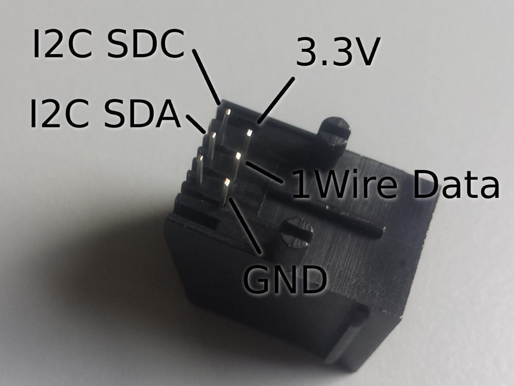
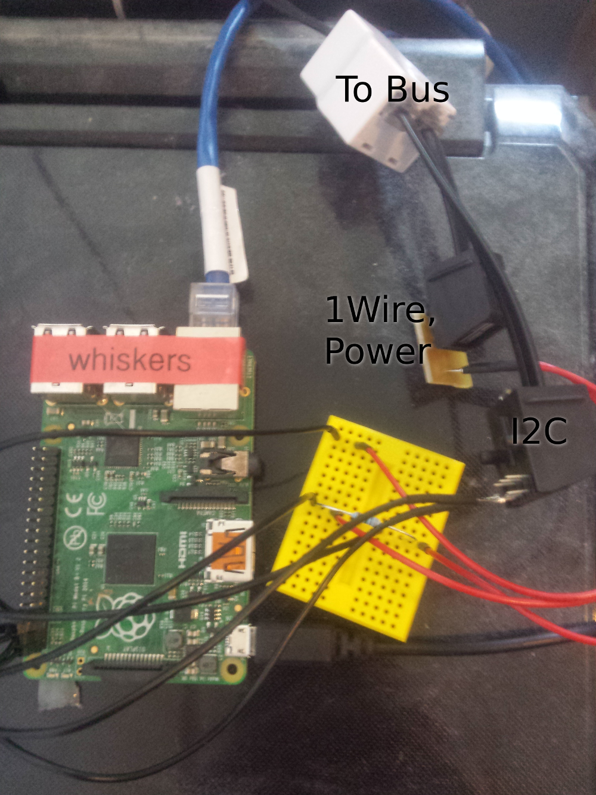

## bus

All sensors are connected using 6-wire modular (phone) cables. These are very cheap and sufficient for my purposes.

- [Cable MPFK 6S-100](https://www.reichelt.de/Modular-Fernmeldeleitung/MPFK-6S-100/3/index.html?ACTION=3&LA=446&ARTICLE=12732&GROUPID=5033&artnr=MPFK+6S-100)
- [Socket MEBP 6-6S](https://www.reichelt.de/Modular-Stecker-Einbaubuchsen-Adapter-/MEBP-6-6S/3/index.html?ACTION=3&LA=446&ARTICLE=11370&GROUPID=7306&artnr=MEBP+6-6S) - you will need one for each sensor and a few spare, so buy lots.
- [Plug MP 6-6](https://www.reichelt.de/Modular-Stecker-Einbaubuchsen-Adapter-/MP-6-6/3/index.html?ACTION=3&LA=446&ARTICLE=12707&GROUPID=7306&artnr=MP+6-6) - you will need even more of these. Really cheap and you'll break a few by accident so don't be stingy.
- [Adapter WB 3X6-6](https://www.reichelt.de/Modular-Stecker-Einbaubuchsen-Adapter-/WB-3X6-6/3/index.html?ACTION=3&LA=446&ARTICLE=33181&GROUPID=7306&artnr=WB+3X6-6)
- [Crimp tool](https://www.reichelt.de/Tester-Werkzeug/MPCZ-6-6/3/index.html?ACTION=3&LA=446&ARTICLE=12719&GROUPID=7307&artnr=MPCZ+6-6)

### Crimping

If you've never done it before, crimping isn't as hard as it may sound.
 
- Make a straight cut at the place you want the plug to be
- Remove the outer insulation (not the colored insulation of the individual conductors!) using the crimp tool
- Push the conductors into the plug
- Put the plug with the conductors into the crimp tool and press it together

You can be pretty forceful here (except when removing insulation or you'll cut through the conductors).

Make sure that the conductors are in the same order on the other side (if the red wire was right on the first plug, it has to be right on the second plug as well).

### Debugging

A multimeter (such as [this one](https://www.amazon.de/gp/product/B00F8ZMNWA), needs a 9V battery) is very useful for debugging. You can check if your wires are properly crimped and you can see if you get the voltage you expect through the bus. I also bought a logic analyzer but it's only rarely useful for the simple setup I have right now.

### Wire layout

My sensors are 1wire and i2c and I use a modified [arw/tempsens](https://gitlab.cs.fau.de/arw/tempsens) layout:

### Master

I use a raspberry pi B+ as my bus master because I had one lying around still.

[Pins](https://pinout.xyz/):
- 1 (3v3) for 3.3V power
- 3 (BCM2/SDA) for i2c data
- 5 (BCM3/SCL) for i2c clock
- 6 (GND) for GND
- 7 (BCM4/GPCLK0) for 1wire data

I have my own 1wire pull-up circuit ([as described here](https://www.modmypi.com/blog/ds18b20-one-wire-digital-temperature-sensor-and-the-raspberry-pi)) using a 1kΩ (I think, but it doesn't matter much) resistor, but the pi might have one built-in anyway, I haven't tried.

1wire and power are soldered using one of the [arw/tempsens](https://gitlab.cs.fau.de/arw/tempsens) circuit boards of which I printed like 20. The i2c plug is soldered directly which is a lot more fragile, I'll probably replace that in the future with a proper circuit board (maybe with an SMD resistor for 1wire too).

