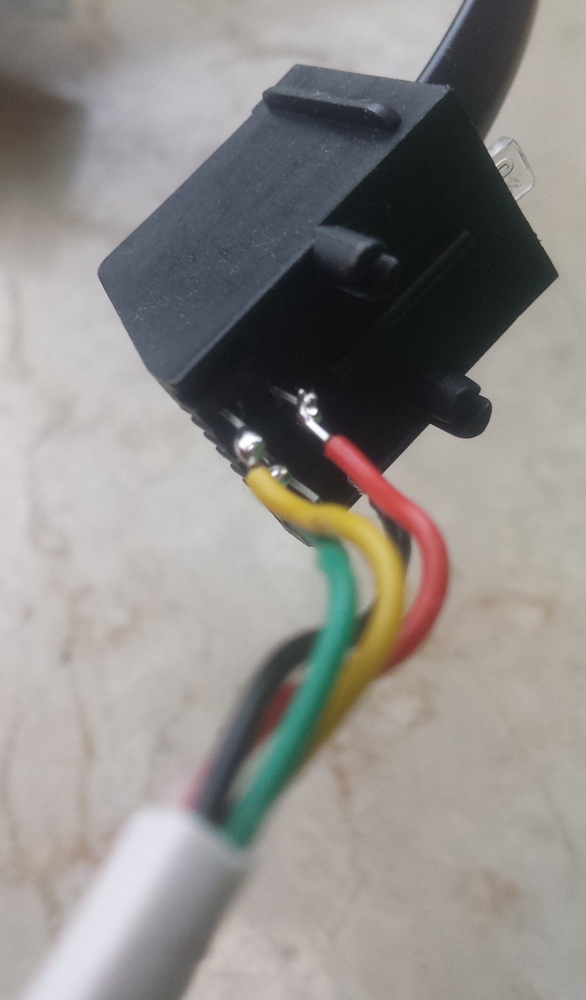
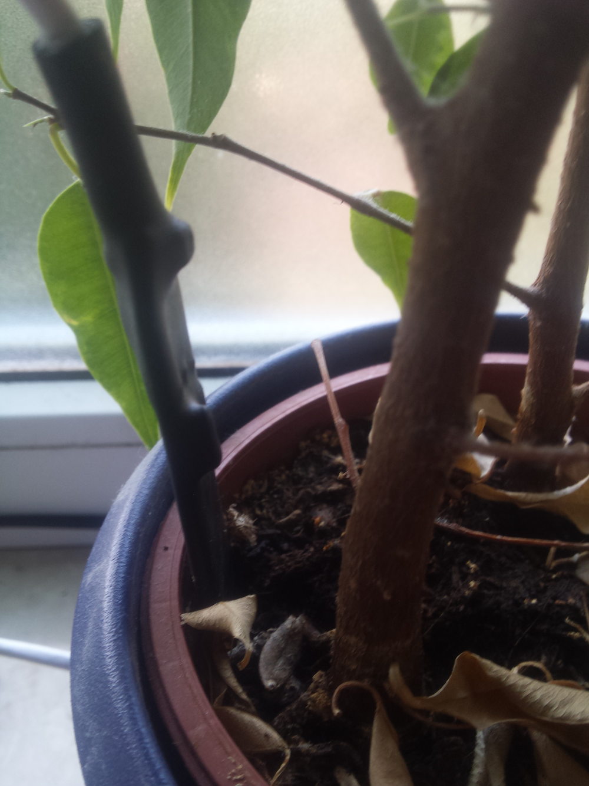

## flower pot

The flower pot sensor is an [i2c soil moisture sensor](https://www.tindie.com/products/miceuz/i2c-soil-moisture-sensor/) (rugged version). The cable coming out of the sensor is soldered directly onto a plug. I might print a nicer PCB for this in the future.

This sensor is mostly untested - it seems to be reporting moisture fine, but I have to see how it behaves in the long term.

This thing also reports temperature but I do not use that reading yet.

See [software](software.html) for details on how data is read.

