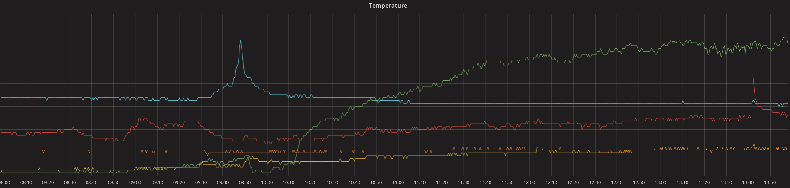

## software

### sensor daemons

The raspberry master reads data from the sensors in 20-second intervals. For this I have written python daemons using [graphitesend](https://github.com/daniellawrence/graphitesend):

- [1wire-graphite](https://github.com/yawkat/1wire-graphite) reads the [temperature sensors](temperature.html). See [pinout/1_wire](https://pinout.xyz/pinout/1_wire) for system setup, then symlink the sensor `w1_slave` files (for example `/sys/devices/w1_bus_master1/28-000008xxxxxx/w1_slave`) into the `sensors` directory next to the daemon, properly aliased (for example `temp.1`). 
- [chirp-graphite](https://github.com/yawkat/chirp-graphite) reads a single [flower pot sensor](flower%20pot.html). See [pinout/i2c](https://pinout.xyz/pinout/i2c) for setup information.

Both projects run as systemd services with `Restart=always` and `RestartSec=5` so they restart automatically when losing connection to the carbon server.

### server

The backend for all my measurement logs is [carbon / graphite](https://graphite.readthedocs.io/) with [graphite-api](https://graphite-api.readthedocs.io/). Data is tunneled from the pi through my NAS to the carbon server (the NAS has a static IPv6 address and has a firewall exemption for the carbon port).

Data is then graphed using [grafana](https://grafana.com/).

The standard temperature query is `alias(1wire.whiskers.temp.1, '<name>')`. I also have an alert set up for my fridge sensor to notify me when it's too warm.
