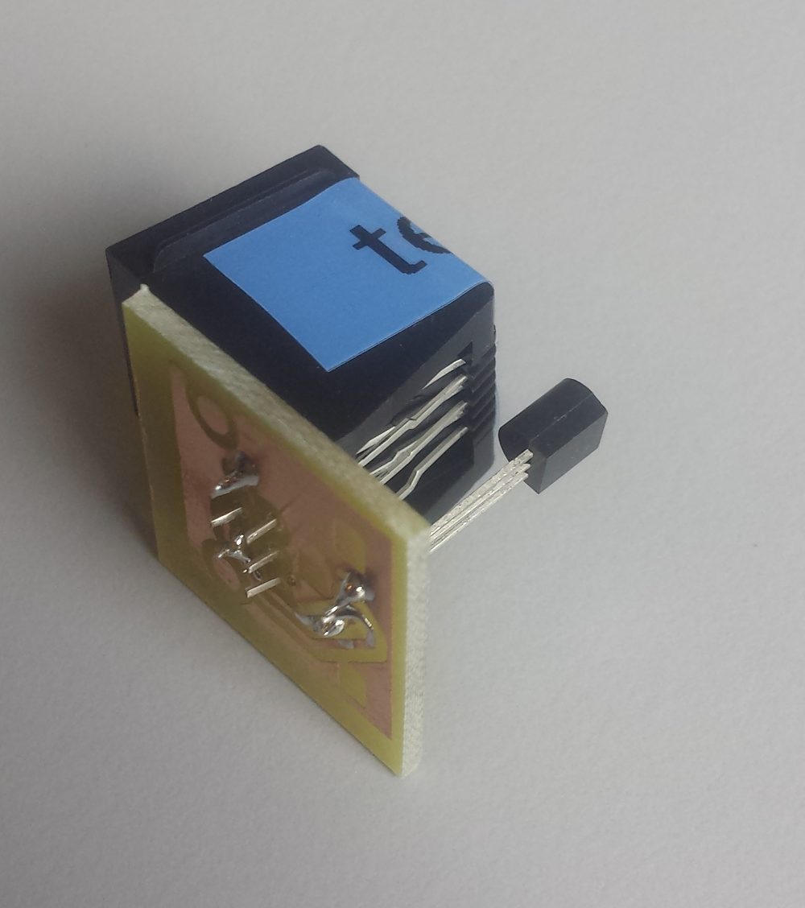
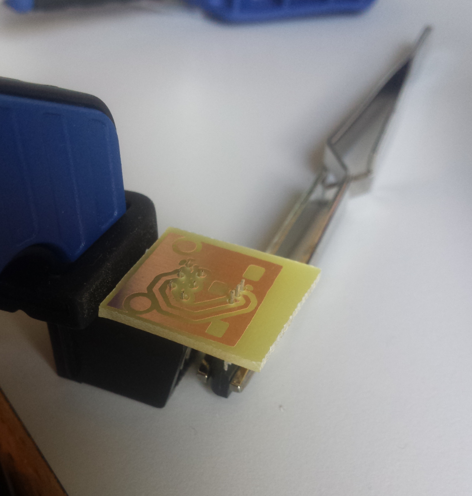

## temperature

See [software](software.html) for details on how data is read from 1wire.

Temperature readings are done using 1wire [DS 18B20](https://www.reichelt.de/ICs-CA-HV-/DS-18B20/3/index.html?ACTION=3&LA=446&ARTICLE=58169&GROUPID=7209&artnr=DS+18B20) sensors soldered onto [arw/tempsens](https://gitlab.cs.fau.de/arw/tempsens) PCBs. I printed these boards at [the local FabLab](http://fablab.fau.de/) which has a PCB printing setup. arw/tempsens also includes schematics for a 3d-printed casing, but I do not use this at the moment.

You could also solder the sensor directly to the plug, but this is more fragile and more difficult.

You need to be very careful with the direction of the sensor. Soldering it the wrong way around will heat it up a lot and it could potentially break.

You may need to cut off the small legs on the socket using a side cutter or the PCB will not fit. The PCB does have hole positions for these legs marked but they did not match the positions on my socket so I did not bother drilling through them.

I am happy with [this soldering iron](https://www.amazon.de/gp/product/B01LXH7BLN) (comes with solder) and [this soldering station](https://www.amazon.de/gp/product/B000V8GRAS). There's also a [cross tweezer](https://www.reichelt.de/Pinzetten/PZ-3/3/index.html?ACTION=3&LA=5&ARTICLE=15036&GROUPID=574&artnr=PZ+3) to hold the sensor in place and a clamp from a local hardware store for the socket. This way you have both hands free for the solder and soldering iron. Soldering without something to keep the small pieces in place is a lot more annoying.

